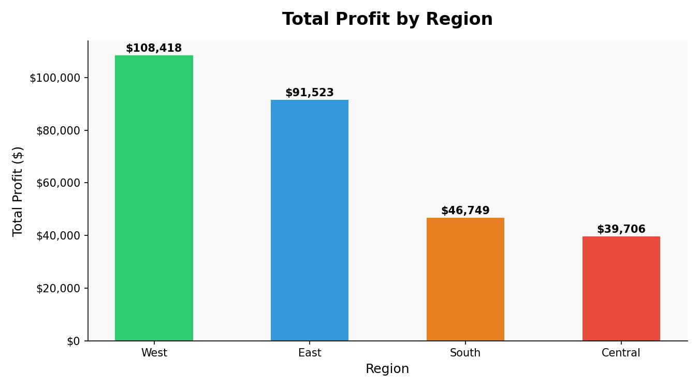
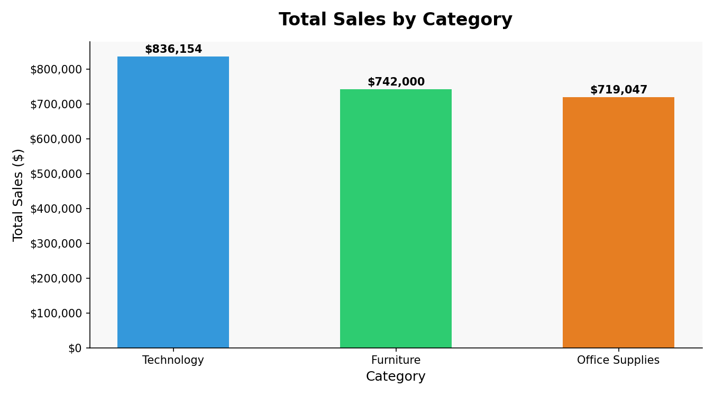
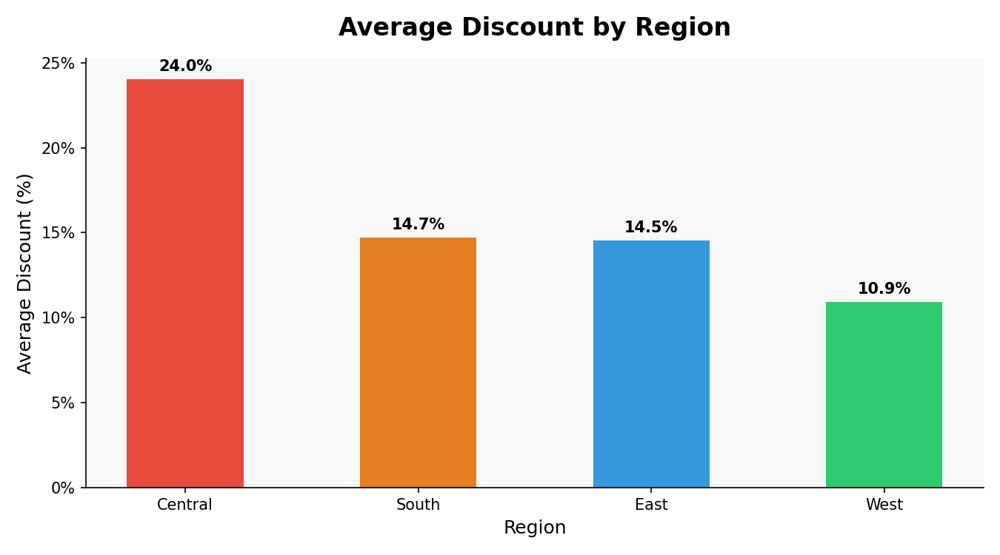

# Retail Sales Dashboard

# Overview
Analysis of 9,994 retail transactions to identify regional profitability trends, 
top revenue-generating product categories, and the impact of discounting on profit.

* Tools Used: Python, pandas, matplotlib

##Business Questions Answered
1. Which region is the most profitable?
2. Which product category drives the most revenue?
3. Which regions give the most discounts and how does that affect profit?

# Key Findings
- The West region is the most profitable at $108,418 in total profit
- Technology is the top revenue category at $836,154 in total sales
- The Central region has the highest average discount rate at 24% and 
  is simultaneously the least profitable region at $39,706
- This suggests excessive discounting in Central is directly hurting profitability

# Charts

# Files
| File | Description |:
| explore.py | Initial data exploration and summary statistics |
| analysis.py | Core analysis — groupby calculations and findings |
| charts.py | Professional chart generation and formatting |
